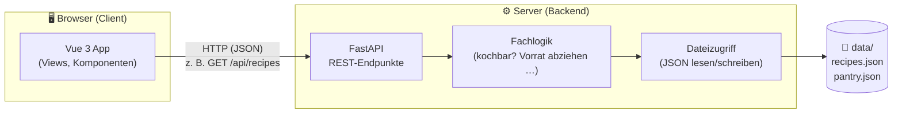
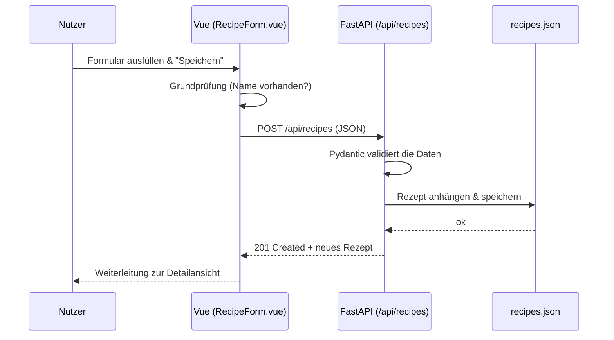

# Architektur – Rezept-App „Kochbuch"

Dieses Dokument beschreibt den Tech-Stack und die Architektur für die Rezept-App,
die in den [User Stories](user-stories.md) (US-01 bis US-12) beschrieben ist.

Es ist bewusst für **Einsteiger in die moderne Web-Entwicklung** geschrieben und
erklärt nicht nur *was*, sondern auch *warum* eine Technologie gewählt wurde.

---

## 1. Ziel & Rahmenbedingungen

- **Ziel:** Lernprojekt – moderne Web-Entwicklung kennenlernen (im Rahmen des GenAI-Kurses).
- **Datenhaltung:** leichtgewichtiges Backend, **keine klassische Datenbank**, Speicherung in **JSON-Dateien**.
- **Frontend:** **Vue** (bereits Erfahrung vorhanden).
- **Vorwissen:** JavaScript gut, Python etwas, Vue in Grundzügen.

> Der bestehende Prototyp unter [`app/`](../app/README.md) ist reines HTML/CSS/JS mit
> `localStorage`. Diese Architektur beschreibt den **nächsten Schritt**: eine echte
> Frontend-/Backend-Trennung. Der Prototyp dient weiterhin als fachliche Referenz
> (die Logik in [`app/logic.js`](../app/logic.js) kann als Vorlage dienen).

---

## 2. Überblick: Wie passt alles zusammen?

Die App besteht aus **zwei getrennten Teilen**, die über eine **REST-API** (HTTP + JSON)
miteinander reden. Das ist das Standard-Muster moderner Web-Apps.



**In Worten:**
1. Das **Vue-Frontend** zeigt die Oberfläche an und schickt Anfragen an das Backend.
2. Das **FastAPI-Backend** nimmt die Anfragen an, führt die Fachlogik aus und liest/schreibt Daten.
3. Die **Daten** liegen als einfache **JSON-Dateien** auf dem Server – keine Datenbank nötig.

---

## 3. Tech-Stack im Detail

### 3.1 Frontend

| Technologie | Wofür | Warum diese Wahl |
|---|---|---|
| **Vue 3** (Composition API) | UI-Framework | Du hast bereits Vue-Erfahrung. Vue ist einsteigerfreundlich und gut dokumentiert. |
| **Vite** | Build-Tool & Dev-Server | Startet sofort, lädt Änderungen live (Hot Reload). Der moderne Standard für Vue. |
| **Vue Router** | Seiten-Navigation | Für die Bereiche „Rezepte", „Vorrat", „Heute kochen" und Detailseiten (US-02, US-03, US-08, US-10). |
| **Fetch API** (eingebaut) | HTTP-Anfragen ans Backend | Standard im Browser, keine Zusatzbibliothek nötig. (Optional später `axios`.) |
| **Plain CSS** (oder Pinia bei Bedarf) | Styling / State | Zum Lernen bewusst schlank gehalten. |

> **Bewusst weggelassen (zum Start):** TypeScript, Pinia (State-Management), UI-Bibliotheken.
> Diese kannst du später ergänzen, wenn die Grundlagen sitzen – siehe Abschnitt 8.

### 3.2 Backend

| Technologie | Wofür | Warum diese Wahl |
|---|---|---|
| **Python 3.11+** | Programmiersprache | Du kennst etwas Python; gut lesbar. |
| **FastAPI** | Web-Framework / REST-API | Sehr einsteigerfreundlich, erzeugt **automatisch eine API-Doku** (Swagger UI unter `/docs`). |
| **Uvicorn** | Server zum Starten der App | Standard-Server für FastAPI. |
| **Pydantic** (in FastAPI enthalten) | Datenvalidierung | Prüft automatisch, ob eingehende Daten gültig sind (z. B. US-01: Name ist Pflicht). |
| **JSON-Dateien** | Datenspeicher | Leichtgewichtig, kein DB-Setup, Dateien sind lesbar und einfach zu sichern. |

> **Warum nicht Node.js im Backend?** Das ginge auch (eine Sprache überall).
> Hier nutzen wir bewusst **Python**, weil du es lernen möchtest und FastAPI besonders
> gut erklärt, was eine API ist. Die Alternative (Node + Express) steht in Abschnitt 8.

### 3.3 Werkzeuge

| Werkzeug | Wofür |
|---|---|
| **Node.js + npm** | Nötig, um das Vue-Frontend zu bauen/starten. |
| **Python venv** | Virtuelle Umgebung, damit Python-Pakete projektweise installiert werden. |
| **Git** | Versionsverwaltung (bereits im Einsatz). |

---

## 4. Projektstruktur (Vorschlag)

```text
GenAIKurs/
├─ app/                    # bestehender Prototyp (bleibt als Referenz)
├─ docs/
│  ├─ user-stories.md
│  ├─ definition_of_ready.md
│  └─ architecture.md      # dieses Dokument
│
├─ frontend/               # NEU: Vue-App
│  ├─ index.html
│  ├─ package.json
│  ├─ vite.config.js
│  └─ src/
│     ├─ main.js           # Einstiegspunkt
│     ├─ App.vue           # Grundgerüst + Navigation
│     ├─ router.js         # Seiten-Routen
│     ├─ api.js            # zentrale Funktionen für Backend-Aufrufe
│     ├─ views/            # ganze Seiten
│     │  ├─ RecipeList.vue     # US-02, US-06
│     │  ├─ RecipeDetail.vue   # US-03, US-05, US-12
│     │  ├─ RecipeForm.vue     # US-01, US-04
│     │  ├─ Pantry.vue         # US-07, US-08, US-09
│     │  └─ Today.vue          # US-10, US-11
│     └─ components/       # wiederverwendbare Bausteine
│        ├─ IngredientRow.vue
│        └─ BadgeCookable.vue
│
└─ backend/                # NEU: FastAPI-App
   ├─ requirements.txt     # Python-Abhängigkeiten
   ├─ main.py              # FastAPI-App + Endpunkte
   ├─ models.py            # Datenmodelle (Pydantic)
   ├─ storage.py           # JSON-Dateien lesen/schreiben
   ├─ logic.py             # Fachlogik (kochbar?, Vorrat abziehen …)
   └─ data/
      ├─ recipes.json
      └─ pantry.json
```

---

## 5. Datenmodell

Die Datenstrukturen entsprechen dem bestehenden Prototyp, damit vorhandene Logik
wiederverwendbar bleibt.

### Rezept (`recipe`)

```json
{
  "id": "a1b2c3",
  "name": "Spaghetti Aglio e Olio",
  "ingredients": [
    { "name": "Spaghetti", "amount": 250, "unit": "g" },
    { "name": "Knoblauch", "amount": 3, "unit": "Stk" }
  ],
  "steps": "Spaghetti kochen.\nKnoblauch anbraten."
}
```

### Vorrats-Eintrag (`pantry item`)

```json
{ "id": "x9y8z7", "name": "Spaghetti", "amount": 500, "unit": "g" }
```

**Erlaubte Einheiten:** `g`, `kg`, `ml`, `l`, `Stk`, `EL`, `TL`, `Prise`
(mit Umrechnung g↔kg und ml↔l, wie im Prototyp).

---

## 6. API-Endpunkte (REST)

Das Frontend spricht das Backend über diese HTTP-Endpunkte an. Jeder Endpunkt ist
einer oder mehreren User Stories zugeordnet.

| Methode | Pfad | Zweck | User Story |
|---|---|---|---|
| `GET` | `/api/recipes` | Alle Rezepte (optional `?q=suchbegriff`) | US-02, US-06 |
| `GET` | `/api/recipes/{id}` | Ein Rezept im Detail | US-03 |
| `POST` | `/api/recipes` | Neues Rezept anlegen | US-01 |
| `PUT` | `/api/recipes/{id}` | Rezept bearbeiten | US-04 |
| `DELETE` | `/api/recipes/{id}` | Rezept löschen | US-05 |
| `GET` | `/api/pantry` | Vorrat anzeigen | US-08 |
| `POST` | `/api/pantry` | Lebensmittel hinzufügen | US-07 |
| `PUT` | `/api/pantry/{id}` | Menge ändern | US-09 |
| `DELETE` | `/api/pantry/{id}` | Lebensmittel entfernen | US-09 |
| `GET` | `/api/cookable` | Kochbare & fast kochbare Rezepte | US-10, US-11 |
| `POST` | `/api/recipes/{id}/cook` | Vorrat nach dem Kochen abziehen | US-12 |

> Die Validierung (US-01: Name + mind. eine Zutat) übernimmt **Pydantic** im Backend
> und zusätzlich die Vue-Formulare im Frontend (sofortiges Feedback für den Nutzer).

### Beispiel-Ablauf: Rezept anlegen (US-01)



---

## 7. Wie wird die App gestartet? (Entwicklung)

Zwei Prozesse laufen parallel – je ein Terminal:

**Backend (Python):**
```bash
cd backend
python -m venv .venv
.venv\Scripts\activate        # Windows
pip install -r requirements.txt
uvicorn main:app --reload      # läuft auf http://localhost:8000
```
→ API-Doku automatisch unter `http://localhost:8000/docs`

**Frontend (Vue):**
```bash
cd frontend
npm install
npm run dev                    # läuft auf http://localhost:5173
```

> **CORS-Hinweis:** Da Frontend (Port 5173) und Backend (Port 8000) getrennt laufen,
> muss das Backend sogenannte **CORS**-Zugriffe erlauben. FastAPI bietet dafür eine
> fertige Middleware – das wird bei der Umsetzung einmalig konfiguriert.

---

## 8. Ausbaustufen (später, optional)

Bewusst **nicht** im ersten Wurf enthalten, aber gute nächste Lernschritte:

| Thema | Was & warum |
|---|---|
| **TypeScript** | Typsicherheit im Frontend – fängt Fehler früh ab. |
| **Pinia** | Zentrales State-Management, wenn die App größer wird. |
| **SQLite** | Immer noch „nur eine Datei", aber mit echter DB-Abfrage – nächster Schritt nach JSON. |
| **Authentifizierung** | Login, damit mehrere Nutzer getrennte Rezepte haben. |
| **Deployment** | Frontend als statische Dateien + Backend z. B. auf einem kleinen Server hosten. |
| **Tests** | `pytest` (Backend) und `Vitest` (Frontend), analog zu [`app/logic.test.js`](../app/logic.test.js). |

### Alternative Stacks (falls du vergleichen willst)

- **Alles JavaScript:** Vue + **Node.js/Express**-Backend → nur eine Sprache.
- **Alles in einem Framework:** **Nuxt** (Vue mit integriertem Backend) → weniger Setup, aber mehr „Magie".

---

## 9. Zusammenfassung

- **Frontend:** Vue 3 + Vite (du kennst Vue bereits).
- **Backend:** FastAPI (Python, einsteigerfreundlich, nutzt dein Python-Wissen).
- **Daten:** JSON-Dateien statt Datenbank – leichtgewichtig und nachvollziehbar.
- **Verbindung:** REST-API über HTTP + JSON – das zentrale Muster, das du hier lernst.
- **Klarer Ausbaupfad:** von JSON → SQLite, von JS → TypeScript, etc.

Diese Architektur hält die Einstiegshürde niedrig, zeigt dir aber die **echte
Trennung von Frontend und Backend**, die in fast jeder modernen Web-App vorkommt.
