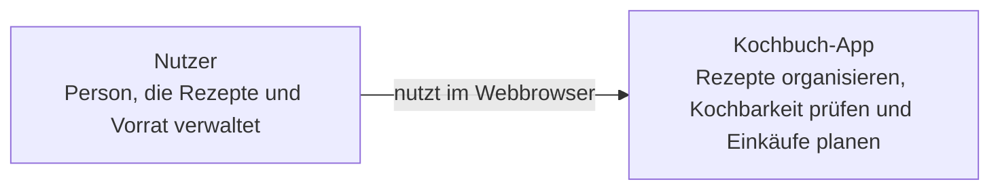
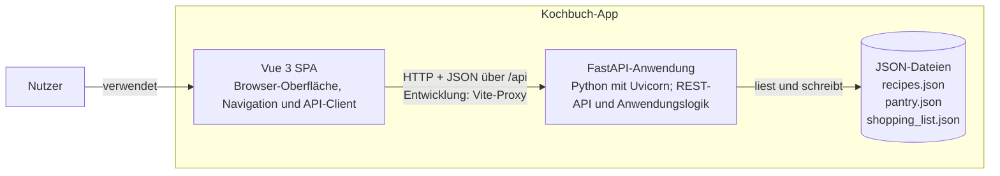
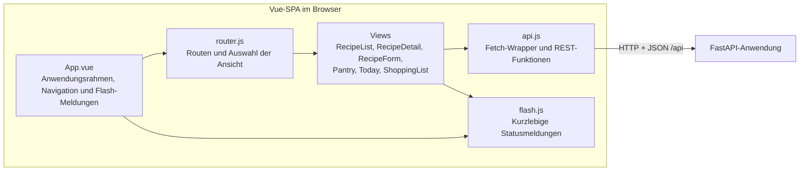
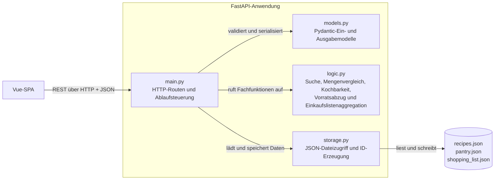

# C4-Architektur der Kochbuch-App

Dieses Dokument beschreibt den implementierten Architekturstand der Kochbuch-App
mit den C4-Ebenen Systemkontext, Container und Komponenten. Die Diagramme verwenden
Mermaid und ergänzen den technischen Überblick in [architecture.md](architecture.md).

## C1 – Systemkontext

Die Kochbuch-App unterstützt einen Nutzer bei Rezeptverwaltung, Vorrat und
Einkaufsplanung. Im dokumentierten Umfang gibt es keine externen Software-Systeme.

## C2 – Container

Die Anwendung besteht aus einer Vue-Anwendung im Browser, einem FastAPI-Backend
und JSON-Dateien für die dauerhafte Speicherung. Im Entwicklungsbetrieb leitet der
Vite-Server API-Anfragen vom Frontend an das Backend weiter.

| Container | Technologie | Verantwortung |
|---|---|---|
| Vue-SPA | Vue 3, Vue Router, Fetch API | Zeigt die Ansichten an und kommuniziert mit dem Backend. |
| FastAPI-Anwendung | Python, FastAPI, Uvicorn, Pydantic | Stellt REST-Endpunkte bereit, validiert API-Daten und orchestriert die Fachlogik. |
| JSON-Dateien | JSON auf dem lokalen Dateisystem | Speichern Rezepte, Vorrat und Einkaufsliste ohne separate Datenbank. |

## C3 – Komponenten

### Frontend

Die Ansichten enthalten den jeweiligen Bedienablauf. `api.js` kapselt die
Backend-Aufrufe; die Vite-Konfiguration proxyt `/api` im Entwicklungsbetrieb an
`http://localhost:8000`.

### Backend

| Komponente | Quelle | Verantwortung |
|---|---|---|
| API-Routen | `backend/main.py` | Nimmt Requests entgegen, prüft IDs und verbindet Modelle, Fachlogik und Speicher. |
| Datenmodelle | `backend/models.py` | Validiert und beschreibt Rezept-, Vorrats- und Einkaufslisten-Daten. |
| Fachlogik | `backend/logic.py` | Berechnet fehlende Mengen, Kochbarkeit, Suche, Vorratsabzug und Zusammenführung der Einkaufsliste. |
| JSON-Speicher | `backend/storage.py` | Liest und schreibt JSON-Dateien und erzeugt IDs. |

## Laufzeit und Grenzen

- Das Frontend verwendet den relativen API-Pfad `/api`; im lokalen Entwicklungsbetrieb
  übernimmt Vite den Proxy zum Backend auf Port 8000.
- Die Datenhaltung erfolgt über lokale JSON-Dateien. Es gibt keine Datenbank,
  Authentifizierung oder externen Integrationssysteme im aktuellen Umfang.
- Diese Dokumentation zeigt die Komponentenstruktur, nicht eine konkrete
  Produktions- oder Deployment-Topologie.